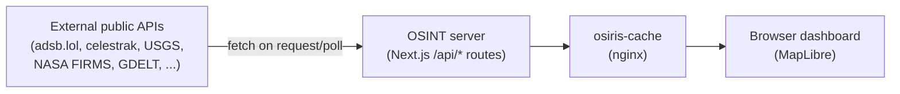
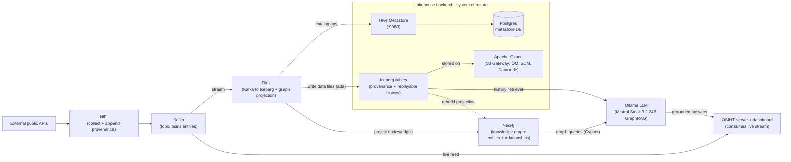

<div align="center">

# OSINT

### Open Source Intelligence Platform

[](https://nextjs.org)
[](https://typescriptlang.org)
[](https://maplibre.org)
[](LICENSE)

**A real-time global intelligence dashboard that aggregates live flight tracking, CCTV networks, earthquake monitoring, conflict zone mapping, and 24/7 news feeds into a single GPU-accelerated interface.**

[Report Bug](https://github.com/simplifaisoul/osiris/issues) · [Architecture](docs/architecture.md) · [Lakehouse Recorder](docs/lakehouse-recorder.md)

</div>

---

## Based on OSIRIS

**OSINT** is a customized deployment built on **[OSIRIS](https://github.com/simplifaisoul/osiris)** — the *Open Source Intelligence & Reconnaissance Integrated System* by **[simplifaisoul](https://github.com/simplifaisoul)**.

| | |
|---|---|
| **Upstream repository** | [github.com/simplifaisoul/osiris](https://github.com/simplifaisoul/osiris) |
| **Upstream live demo** | [osirisai.live](https://osirisai.live) |
| **Upstream license** | [MIT](LICENSE) — Copyright (c) simplifaisoul |

This fork extends the upstream codebase with a lakehouse backend (Kafka, NiFi, Flink, Iceberg, Neo4j, Ollama), an optional data recorder, and project-specific UI and ingest changes. Core dashboard capabilities, API routes, and the RECON toolkit inherit from OSIRIS.

If you use or redistribute this work, please retain the upstream MIT license notice and credit the [OSIRIS project](https://github.com/simplifaisoul/osiris).

---

## Overview

OSINT is a production-grade OSINT platform that provides situational awareness across multiple intelligence domains. Built with Next.js 16 and MapLibre GL, every data point is rendered via WebGL for 60fps performance even with thousands of concurrent entities on-screen.

### Key Capabilities

| Domain | Data Points | Sources |
|--------|------------|---------|
| **Aviation** | Commercial, Private, Military, Jets | OpenSky Network |
| **Maritime** | 39 Global Ports, 10 Chokepoints | Static Naval Intel |
| **CCTV** | 2,000+ Cameras | TfL, WSDOT, Caltrans, NYC DOT, VicRoads + more |
| **Seismic** | Real-time M2.5+ | USGS Earthquake API |
| **Fires** | Active Hotspots | NASA FIRMS |
| **News** | 24/7 Live Streams | 25+ Global Broadcasters |
| **Weather** | Severe Events | NASA EONET |
| **Space** | Solar Weather, Satellites | NOAA SWPC, N2YO |
| **Cyber** | CVE Threats, Vulnerability Scanning | NVD, Custom Scanner |
| **Conflict** | 13 Active Zones | Static OSINT Intel |
| **Crypto** | BTC + ETH Wallet Tracing, OFAC SDN Match | blockstream.info, Blockscout, OpenSanctions |
| **Sanctions** | Person / Org / Vessel SDN Search | OpenSanctions (US OFAC SDN mirror) |
| **Telegram OSINT** | Geoparsed Posts from Public Channels | `t.me/s/<channel>` web preview |

---

## Architecture

```
┌─────────────────────────────────────────────────┐
│                  OSINT CLIENT                    │
│  ┌──────────┐  ┌──────────┐  ┌───────────────┐ │
│  │ MapLibre  │  │  HUD     │  │  RECON Toolkit│ │
│  │  GL (GPU) │  │ Panels   │  │  Port Scan    │ │
│  │  WebGL    │  │ Layers   │  │  DNS / WHOIS  │ │
│  │  Render   │  │ Controls │  │  Vuln Scanner │ │
│  └──────────┘  └──────────┘  └───────────────┘ │
├─────────────────────────────────────────────────┤
│               NEXT.JS API ROUTES                 │
│  /api/flights         /api/earthquakes          │
│  /api/cctv            /api/news                 │
│  /api/fires           /api/maritime             │
│  /api/gdelt           /api/satellites           │
│  /api/weather         /api/scanner              │
│  /api/sentinel        /api/telegram-feed        │
│  /api/osint/*  (whois, dns, ip, cve, sanctions, │
│                 crypto, sweep, threats, …)      │
├─────────────────────────────────────────────────┤
│              EXTERNAL DATA SOURCES               │
│  OpenSky · USGS · NASA · NOAA · TfL · NVD      │
│  GDACS · EONET · FIRMS · N2YO · RSS Feeds      │
│  blockstream.info · Blockscout · OpenSanctions  │
│  t.me public previews                            │
└─────────────────────────────────────────────────┘
```

### Data Flow

Full write-up: **[docs/architecture.md](docs/architecture.md)**.

**Connected mode — OSINT calls APIs directly (upstream OSIRIS pattern):**



**Extended stack — streaming + lakehouse + knowledge graph + LLM:**



---

## Features

### Intelligence Layers
- **16 toggleable data layers** with real-time entity counts
- **GPU-accelerated rendering** — all map data rendered via WebGL, not DOM
- **Progressive loading** — data fetched on-demand when layers are activated
- **Viewport-aware** — only loads relevant data for the visible region

### RECON Toolkit
- **Port Scanner** — TCP connect scan with service fingerprinting
- **DNS Lookup** — Full record resolution (A, AAAA, MX, NS, TXT, CNAME)
- **WHOIS** — Domain/IP registration data (auto-cross-checked against OFAC SDN)
- **SSL/TLS Inspector** — Certificate chain analysis
- **IP Intelligence** — Geolocation, ASN, threat reputation (auto-cross-checked against OFAC SDN)
- **Vulnerability Scanner** — CVE lookup against NVD database
- **Crypto Wallet Trace** — BTC + ETH lookup (balance, tx history, OFAC SDN sanctions flag)
- **OFAC Sanctions Search** — query persons, organizations, vessels and aircraft against the US OFAC SDN list

### Live Broadcast Network
- **25+ live 24/7 news streams** from global broadcasters
- Click any news dot on the map to open the live stream
- Feeds from NBC, CBS, ABC, Sky News, Al Jazeera, France 24, NHK, WION, and more

### Telegram OSINT Layer
- **Public-channel feed** scraped from the unauthenticated `t.me/s/<channel>` web preview — no Bot API token, no MTProto
- Default curated set of 5 channels (EN + RU/UA war reporting), overridable via `OSIRIS_TELEGRAM_CHANNELS`
- Posts are geoparsed against a multilingual place dictionary (EN + Cyrillic + Arabic) and plotted on the map
- Click any cyan dot to read the post and jump to the original on Telegram

### Crypto Wallet Intelligence
- **BTC** lookups via [blockstream.info](https://blockstream.info) (Esplora API, keyless)
- **ETH** lookups via [Blockscout](https://github.com/blockscout/blockscout)'s public ETH instance (`eth.blockscout.com`, keyless)
- Every lookup is cross-checked against the OFAC SDN sanctioned-address list (mirrored from [`0xB10C/ofac-sanctioned-digital-currency-addresses`](https://github.com/0xB10C/ofac-sanctioned-digital-currency-addresses))
- Sanctioned wallets surface a red **SANCTIONED — OFAC SDN** badge in the RECON panel

### OFAC SDN Cross-Check
- Standalone `SANCTIONS` tab in the RECON toolkit — full-text search across persons, organisations, vessels and aircraft
- WHOIS and IP-intel routes auto-cross-check registrant / ASN-owner names against the SDN list and surface an inline alert
- Data sourced from [OpenSanctions](https://www.opensanctions.org) (CC-BY 4.0) — keyless, ~7 MB cached in-memory for 24h

### Conflict Zone Monitoring
- **13 active conflict/tension zones** with severity-coded warning markers
- Active Wars: Ukraine, Gaza, Sudan, Myanmar, DRC, Yemen
- High Tension: Syria, Lebanon, Sahel, Somalia, Red Sea
- Elevated: Taiwan Strait, Korean DMZ

### Performance Optimized
- **75% reduction in edge requests** vs initial release
- Aggressive polling relaxation (15-30 min intervals for stable data)
- Static data served from memory (zero external API calls for news feeds)
- `layerFetchedRef` prevents duplicate API requests

---

## Quick Start

```bash
git clone <your-repository-url>
cd osiris
npm install
npm run dev
```

Open [http://localhost:3000](http://localhost:3000)

### Docker / Self-Hosting

```bash
git clone <your-repository-url>
cd osiris
cp .env.template .env     # optional — configure keys / port
docker compose up -d
```

Open [http://localhost:3000](http://localhost:3000). The image is a multi-stage
`node:22-alpine` standalone build (~220 MB, non-root). The compose file also
carries CasaOS app metadata (`x-casaos:`) for one-click install on
[CasaOS](https://casaos.io). See **[DOCKER.md](DOCKER.md)** for the full Docker,
CasaOS and API-key guide.

**Upstream prebuilt image (GHCR)** — from the original OSIRIS project:

```bash
docker pull ghcr.io/aiacos/osiris:latest
docker run -d -p 3000:3000 --env-file .env ghcr.io/aiacos/osiris:latest
```

**Custom port** — the container always listens on `3000`; set `OSIRIS_PORT` in
`.env` to change the published host port (e.g. `OSIRIS_PORT=3005`) without
editing the compose file.

### Environment Variables

OSINT works **partially without any API keys** — all core feeds use public,
keyless sources. Copy [`.env.template`](.env.template) to `.env` and set only
what you need:

```env
# Published host port (container always listens on 3000). Default: 3000
OSIRIS_PORT=3000

# RECON scanner backend (the only vars the current code reads).
# SCANNER_KEY must match the backend's OSIRIS_KEY — generate with: openssl rand -hex 32
SCANNER_URL=
SCANNER_KEY=

# Optional, for higher rate limits / future sources (see DOCKER.md for signup links)
FIRMS_API_KEY=                # NASA FIRMS  — firms.modaps.eosdis.nasa.gov/api/map_key/
OPENSKY_CLIENT_ID=            # OpenSky OAuth2 (since Mar 2025) — opensky-network.org
OPENSKY_CLIENT_SECRET=
N2YO_API_KEY=                 # N2YO satellites — n2yo.com (Profile → API key)
AIS_API_KEY=                 # aisstream.io maritime
```

> Without `SCANNER_URL`/`SCANNER_KEY` the RECON toolkit returns `503`; every
> other layer works out of the box. `.env` is gitignored — only the template is committed.

---

## Tech Stack

| Layer | Technology |
|-------|-----------|
| Framework | Next.js 16 (App Router, Turbopack) |
| Language | TypeScript 5 |
| Map Engine | MapLibre GL JS (WebGL) |
| Animations | Framer Motion |
| Icons | Lucide React |
| Styling | Custom CSS Design System |
| Deployment | Vercel Edge Network / Docker Compose |

---

## Keyboard Shortcuts

| Key | Action |
|-----|--------|
| `F` | Toggle flight layers |
| `E` | Toggle earthquakes |
| `S` | Toggle satellites |
| `D` | Toggle day/night cycle |
| `Escape` | Close panels |

---

## License

This project is based on [OSIRIS](https://github.com/simplifaisoul/osiris), which is released under the **MIT License** — see [LICENSE](LICENSE) for the upstream copyright (simplifaisoul) and terms.

---

<div align="center">

**Attribution**

OSINT is derived from **[OSIRIS](https://github.com/simplifaisoul/osiris)** by **[simplifaisoul](https://github.com/simplifaisoul)** · [Live demo](https://osirisai.live)

</div>
