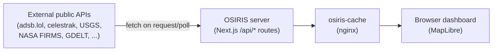
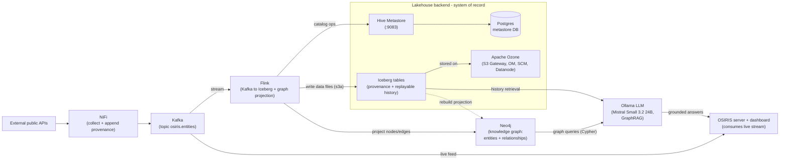

# OSIRIS Architecture

This document captures the evolution of the OSIRIS data architecture: from the
original design where the app called external APIs directly, to the refactored
streaming + lakehouse design where NiFi collects the data, Kafka transports it,
OSIRIS consumes the live stream, a Flink/Iceberg/Ozone lakehouse provides
durable, replayable storage with provenance, a Neo4j knowledge graph holds the
derived entity/relationship layer, and a local LLM (Ollama) answers grounded
questions over both (GraphRAG).

## 1. Original OSIRIS — direct API calls

The OSIRIS Next.js server fetched from external public APIs on request/poll and
rendered the results in the browser (MapLibre), fronted by an nginx cache.

## 2. Refactored OSIRIS — streaming, lakehouse, knowledge graph and LLM

NiFi becomes the collector/producer: it pulls from the sources, appends
provenance metadata, and publishes to the Kafka topic `osiris.entities`. Kafka
fans out to two consumers: OSIRIS for the live dashboard, and Flink for durable
storage. Flink writes Iceberg data files to Ozone over `s3a` (via the S3
gateway) and records table metadata in the Hive Metastore, which persists in
Postgres.

Two analytics components sit on top. **Neo4j** holds a *derived projection* of
the durable entities and their relationships (identity layer), while the Iceberg
lakehouse remains the system of record for full history — the graph can be
rebuilt from it at any time. A local **Ollama LLM** (Mistral Small 3.2 24B)
answers analyst questions by querying the graph and retrieving history from the
lakehouse (GraphRAG), returning grounded, provenance-cited answers to the
dashboard. See `docs/lakehouse-recorder.md` for the dual-write contract and
`docs/osiris-knowledge-graph-schema.md` for the graph model.

## Component reference

| Component | Image | Role | Key port |
|-----------|-------|------|----------|
| NiFi | `apache/nifi:2.0.0` | Collect from sources, append provenance, publish to Kafka | 8443 (HTTPS UI) |
| Kafka | `apache/kafka:4.0.0` | Transport (topic `osiris.entities`), KRaft mode | 29092 (host) / 9092 (in-cluster) |
| Flink | `osiris-flink` (Flink 1.20 + Iceberg 1.9.1) | Stream Kafka -> Iceberg via HiveCatalog | 8081 (UI) |
| Hive Metastore | `osiris-hive-metastore` (Hive 4.0.0) | Iceberg catalog; warehouse on Ozone (`s3a`) | 9083 (Thrift) |
| Postgres | `postgres:16` | Hive Metastore backing store | 5432 (in-cluster) |
| Ozone | `apache/ozone:2.0.0` | Object store / Iceberg warehouse (`s3a://osiris-lake/warehouse`) | 9878 (S3 gateway), 9874 (OM), 9876 (SCM) |
| Neo4j | `neo4j:5.26-community` | Knowledge graph: durable entities + relationships (derived projection of Iceberg) | 7474 (browser), 7687 (Bolt) |
| LLM | `ollama/ollama` (Mistral Small 3.2 24B, 4-bit, GPU) | GraphRAG over Neo4j + Iceberg; OpenAI-compatible API | 11434 |

## Notes on the streaming + lakehouse design

- The demo/replay data lives as NDJSON (`captures/*.ndjson`), not Iceberg. NDJSON
  is the replay source of record; Iceberg is the durable, queryable destination.
- Provenance (source, capture timestamp, lineage/ingest id) travels from NiFi
  through Kafka and is materialized into Iceberg columns for replayability.
- Startup ordering for the lakehouse: Ozone (SCM -> OM -> datanode/s3g) and
  Postgres first, then Hive Metastore (schema init against Postgres), then the
  Flink session cluster.
- The knowledge graph is a **derived projection**: Iceberg is the system of
  record, Neo4j holds only identity + relationships (+ last-known state) and can
  be rebuilt from Iceberg. The graph holds *who/what*; Iceberg holds *history*.
- The LLM runs locally (no external calls) and is grounded: it translates
  questions to Cypher, retrieves the relevant subgraph + Iceberg history, and
  answers with provenance citations (`feed`/`confidence`/`classification`).
