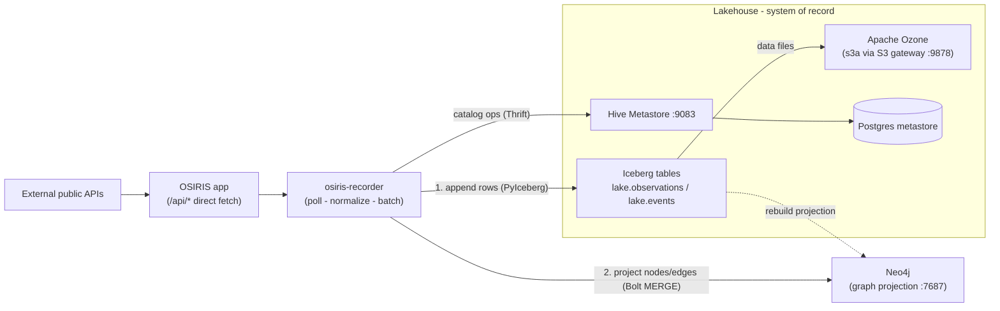

# OSIRIS Lakehouse Recorder — Design

> How OSIRIS lands live API data into the Iceberg lakehouse **without** the
> NiFi→Kafka→Flink pipeline, and how that data powers a replay feature.
>
> Status: **IMPLEMENTED (Phases 0–3).** A PyIceberg recorder container
> (`tools/recorder/`, service `osiris-recorder`) dual-writes the Iceberg
> lakehouse (system of record) and a Neo4j knowledge graph (derived,
> rebuildable projection). Verified end-to-end against the live OSIRIS API
> (see §11). Phase 4 (replay) and Phase 5 (entity resolution / computed edges /
> GraphRAG) remain.

---

## 1. Problem & constraints

When OSIRIS runs against the **original live API feeds** (the app fetches
external sources directly via its `/api/*` routes), the streaming stack
(NiFi → Kafka → Flink) is **not** in the loop. We still want to:

1. **Record** every data point into the durable lakehouse (Iceberg on Ozone).
2. **Project** durable entities + relationships into a knowledge graph (Neo4j).
3. Keep provenance (source, feed, capture time, lineage) on every row/node/edge.
4. Power a **replay feature for past events**.
5. Run cleanly in an **air-gapped** environment.
6. Avoid rework when we later switch to the NiFi/Kafka/Flink build.

Constraint from the owner: **do not** stand up NiFi/Kafka/Flink for the
direct-API demo.

---

## 2. Decision summary

Introduce one new container, **`osiris-recorder`** (Python + PyIceberg +
Neo4j driver), that:

- polls the OSIRIS `/api/*` routes (the same endpoints the existing capture
  tool already knows),
- normalizes each response into provenance-stamped records (the existing
  Polybolos shape),
- **appends** them to Iceberg tables via PyIceberg (using the **existing Hive
  Metastore** as catalog and the **existing Ozone S3 gateway** as storage), and
- **projects** the durable identity/relationship layer into **Neo4j** via
  idempotent `MERGE` (see §7 for the dual-write contract).

We swap only the *writer*. The lakehouse (Ozone + Hive Metastore + Iceberg) is
unchanged, and the table contract is identical to what the Flink job will write
later — so the two ingestion paths converge on one schema. Neo4j is a **derived
projection** of Iceberg, rebuildable at any time.

Rejected alternatives:

| Option | Why not |
|---|---|
| Write Iceberg from the Node app / capture tool | No production-grade Iceberg **writer** exists in JS. |
| Reuse Flink as a periodic filesystem→Iceberg batch job | Reintroduces the engine we're explicitly avoiding for the direct path; heavier to operate. |
| Raw Parquet/NDJSON on Ozone, no table format | Loses the catalog, schema evolution, and time-travel that make replay queryable. |

---

## 3. Architecture



The recorder reaches only in-cluster services (`osiris`, `osiris-hive-metastore`,
`osiris-ozone-s3g`, `osiris-neo4j`) at runtime. The dotted edge denotes that the graph is a
**derived projection** that can be rebuilt from Iceberg at any time (§7).

---

## 4. Recorder container

| Aspect | Choice |
|---|---|
| Image | `python:3.12-slim` + `pyiceberg[hive,s3fs,pyarrow]`, `requests` |
| Catalog | Hive, `thrift://osiris-hive-metastore:9083`, warehouse `s3a://osiris-lake/warehouse` |
| Storage (FileIO) | S3 → Ozone gateway: `s3.endpoint=http://osiris-ozone-s3g:9878`, path-style, key/secret `osiris`/`osiris` |
| Source | Polls `http://osiris:3000/api/*` (base configurable) |
| Loop | Per-endpoint cadence (reuse the `pollMs` values already in the catalog) |
| Write | Batch rows per cycle, append via `table.append(pyarrow_table)` |
| Identity | Each process start gets an `ingest_run_id` (UUID) stamped on every row |

### Poll → normalize → write loop (pseudocode)

```python
run_id = uuid4().hex
catalog = load_catalog("osiris", type="hive", uri="thrift://osiris-hive-metastore:9083",
                       warehouse="s3a://osiris-lake/warehouse", **s3_opts)
obs_tbl   = catalog.load_table("lake.observations")
event_tbl = catalog.load_table("lake.events")

for cycle in scheduler(endpoints):           # respects each endpoint's pollMs
    payload = get_json(base + endpoint.path)
    rows = extract_entities(payload, endpoint)        # same logic as lib.mjs
    obs, events = split_observations_and_events(rows)  # Tier 3 vs Tier 2
    if obs:    obs_tbl.append(to_arrow(obs, run_id))
    if events: event_tbl.append(dedupe(to_arrow(events, run_id)))  # events are immutable
```

### DRY: one endpoint catalog for JS and Python

The endpoint catalog and extraction rules currently live in JS
(`tools/capture/endpoints.config.mjs`, `tools/capture/lib.mjs`). To avoid the
Python recorder drifting from the Node capture/replay tools, extract the catalog
into a **language-neutral `tools/capture/endpoints.json`** that both consume.
The JS `endpoints.config.mjs` becomes a thin loader; the Python recorder reads
the same JSON. (Optional but strongly recommended — otherwise two copies of the
extraction rules must be kept in sync.)

---

## 5. Iceberg table schemas — IMPLEMENTED

Three tables in database `lake` (warehouse `s3a://osiris-lake/warehouse`),
created by `flink/sql/lakehouse_ddl.sql` and verified. They follow the
**bronze → silver** layering and mirror the tiers in `docs/KG_Schema.md`:

| Table | Layer | Holds |
|---|---|---|
| `lake.raw_records` | bronze | exact, loss-less payload as ingested |
| `lake.observations` | silver (Tier 3) | normalized tracks/readings |
| `lake.events` | silver (Tier 2) | normalized immutable occurrences |

> Implementation notes from the build:
> - The bronze table is `raw_records`, **not** `raw` — `RAW` is a reserved
>   keyword in Flink SQL.
> - The old smoke-test `lake.entities` table was **dropped**.
> - All timestamps are real `TIMESTAMP(6) WITH LOCAL TIME ZONE` (Iceberg
>   `timestamptz`), never strings.
> - Flink SQL supports only **identity** partitioning, so each table has an
>   explicit `DATE` partition column (`ingest_date`/`obs_date`/`event_date`)
>   populated by the writer (`CAST(<ts> AS DATE)`) — this gives time-based
>   pruning with full Flink support. The partition spec can still be evolved
>   later via another engine.
> - All three are `format-version=2` (row-level deletes/upserts available).

### `lake.raw_records` (bronze)

| Column | Type | Notes |
|---|---|---|
| `source` | string | feed name |
| `payload` | string | **exact** message bytes (UTF-8) — the long-tail safety net |
| `provider` / `feed` | string | provenance |
| `ingest_run_id` | string | lineage |
| `schema_version` | int | normalization-mapping version |
| `captured_at` | timestamptz | collection time |
| `ingested_at` | timestamptz | processing time |
| `ingest_date` | date | **partition** = `CAST(ingested_at AS DATE)` |

### `lake.observations` (Tier 3 — high volume)

| Column | Type | Notes |
|---|---|---|
| `entity_id` | string | raw OSIRIS id |
| `canonical_id` | string | nullable until entity resolution exists |
| `domain` | string | AIR / SEA / LAND / SPACE / CYBER |
| `entity_type` | string | COMMERCIAL / VESSEL / SATELLITE / ... |
| `name` | string | callsign / label |
| `lat` / `lng` / `alt` / `heading` / `speed` | double | nullable |
| `threat` / `classification` | string | |
| `confidence` | double | |
| `provider` / `feed` / `source_original_id` | string | provenance |
| `observed_at` | timestamptz | **event time** |
| `captured_at` / `ingested_at` | timestamptz | **processing time** (lineage/replay) |
| `ingest_run_id` | string | lineage |
| `schema_version` | int | mapping version |
| `properties` | string (JSON) | source-specific long tail |
| `obs_date` | date | **partition** = `CAST(observed_at AS DATE)` |

**Partitioning:** `(obs_date, domain)`.

### `lake.events` (Tier 2 — immutable occurrences)

| Column | Type | Notes |
|---|---|---|
| `event_id` | string | natural id (`originalId`: USGS/FIRMS/GDELT id, news url) |
| `event_type` | string | SEISMIC / FIRE / GDELT / NEWS / ... |
| `domain` | string | |
| `name` | string | place / title |
| `lat` / `lng` | double | |
| `magnitude` / `brightness` | double | nullable, type-specific (promoted columns) |
| `provider` / `feed` / `source_original_id` | string | provenance |
| `occurred_at` | timestamptz | **event time** |
| `captured_at` / `ingested_at` | timestamptz | processing time |
| `ingest_run_id` | string | lineage |
| `schema_version` | int | mapping version |
| `properties` | string (JSON) | raw |
| `event_date` | date | **partition** = `CAST(occurred_at AS DATE)` |

**Partitioning:** `(event_date, event_type)`. Dedupe on `event_id` (events never update).

### Canonical Kafka message contract (topic `osiris.entities`)

The writer(s) emit one JSON object per record; the Flink job
(`flink/sql/kafka_to_lakehouse.sql`) parses it. New feeds add keys under
`entity.properties` with **no schema change**:

```json
{
  "schema_version": 1,
  "ingest_run_id": "<uuid>",
  "source": "flights",
  "captured_at": "2026-06-24T20:45:51Z",
  "entity": {
    "id": "a1b2c3", "name": "OSY101", "domain": "AIR", "entityType": "COMMERCIAL",
    "position": {"lat":50.45,"lng":30.52,"alt":11000,"heading":270,"speed":450},
    "threat":"NONE","classification":"UNCLASSIFIED","confidence":0.9,
    "timestamp":"2026-06-24T20:45:50Z",
    "source":{"provider":"osiris","feed":"flights","originalId":"a1b2c3","confidence":0.9},
    "properties": { "...": "source-specific" }
  }
}
```

### Write path — Pattern B (atomic fan-out), verified

`flink/sql/kafka_to_lakehouse.sql` reads the topic **once** as a raw `payload`
string, then a single `EXECUTE STATEMENT SET` writes all three tables in one
job / shared checkpoint lifecycle:
- `raw_records` ← every message (exact payload),
- `observations` ← non-event feeds,
- `events` ← event feeds (`earthquakes`, `fires`, `gdelt`, `news`, `live-news`, `weather`).

Verified with 6 seed messages → `raw_records=6`, `observations=4`, `events=2`,
with timestamps, geo, `properties` JSON, and `magnitude`/`brightness` all parsed
correctly. (Caveat: a `STATEMENT SET` shares one job lifecycle but is **not** a
cross-table atomic transaction — each Iceberg table commits independently per
checkpoint; bronze remains the reconciliation source.)

---

## 6. Provenance & lineage

- Every row carries `provider` + `feed` (where it came from) and `captured_at`
  (when). This matches the provenance the SDK ingest route already builds
  (`src/app/api/sdk/ingest/route.ts`, `source.{provider,feed,originalId,confidence}`).
- `ingest_run_id` ties a set of rows to a single recorder process — the cheap
  lineage key that makes a capture run independently auditable and replayable.
- These are the exact columns the KG layer later reads onto graph nodes/edges
  ("every node and edge carries provenance").

---

## 7. Dual-write: lakehouse (system of record) + knowledge graph

The recorder writes to **two** sinks, but they are **not** symmetric copies.
The governing principle (straight from `docs/osiris-knowledge-graph-schema.md`):

> **Iceberg is the system of record; Neo4j is a derived projection.**
> Iceberg holds *all* history (every observation + every event). Neo4j holds the
> durable *identity + relationship* layer plus last-known state — never the
> high-volume position/measurement stream.

### What goes where

| Data | → Iceberg | → Neo4j |
|---|---|---|
| **Tier 3 observations** (position pings, weather/AQ/market readings) | every row, full history (`lake.observations`) | only **last-known** props on the platform node (`lastLat`, `lastLng`, `lastObserved`, ...) — no history |
| **Tier 2 events** (quake / fire / gdelt / news) | every row (`lake.events`) | one `Event` node, `MERGE` on `event_id` |
| **Tier 1 durable entities** (Vessel, Aircraft, Satellite, Facility, Port, Organization, Country, ...) | present as columns within observation rows | first-class **nodes**, `MERGE` on natural key |
| **Relationships** (`OPERATED_BY`, `OWNED_BY`, `FLAGGED_TO`, `SUPPLIES`, ...) | implicit in `properties` | structural **edges**, `MERGE` |

### Write flow (one batch per poll cycle)

```
1. normalize(payload)            -> records (+ provenance + captured_at + ingest_run_id)
2. APPEND to Iceberg             -> lake.observations / lake.events   [must succeed; SoR]
3. PROJECT to Neo4j (idempotent) -> UNWIND $rows:
     MERGE (n:<Label> {<naturalKey>})         // durable node
       SET n.lastLat=..., n.lastObserved=..., n += provenance
     MERGE (n)-[r:<EDGE>]->(m) SET r += {feed, confidence, derivedBy, validFrom}
     // events: MERGE (e:Event {event_id}) — immutable, no overwrite
```

### Why this ordering & idempotency

- **Iceberg first, graph second.** History is the durable asset; the graph is a
  queryable *view* of identity/relationships. If Neo4j is down or a projection
  errors, the observation is already safe in Iceberg and the recorder keeps
  going — the graph is **non-blocking**.
- **Every graph write is idempotent** (`MERGE` on natural keys; events `MERGE`
  on `event_id`). Re-running a batch, or a full rebuild, **converges** with no
  duplicates.
- **The graph is rebuildable.** Because Iceberg has the full history and the
  projection is idempotent, you can `DROP` the graph and **replay Iceberg
  through the same projection function** to reconstruct it. This is the dotted
  edge in the §3 diagram.

### One projection function, three triggers

The node/edge `MERGE` logic lives in **one** module, invoked from:

| Trigger | When | Source |
|---|---|---|
| **inline** | live, per poll cycle | the batch just appended to Iceberg |
| **rebuild** | on demand / after schema change | scan `lake.observations` + `lake.events` |
| **streaming** (future) | air-gapped NiFi→Kafka→Flink build | Kafka / Flink sink calls the same logic |

This keeps the direct-API path and the future streaming path writing an
identical graph — no divergence.

### Failure handling

| Failure | Behavior |
|---|---|
| Iceberg append fails | skip the Neo4j projection for that batch, log, retry next cycle (data is re-polled). |
| Neo4j projection fails | Iceberg already durable; recorder continues. Reconcile via next cycle or a full rebuild. |
| Partial batch (crash) | `ingest_run_id` identifies the run; idempotent `MERGE` makes re-projection safe. |

### Entity resolution caveat (v1)

Natural-key nodes (`Vessel.mmsi`, `Aircraft.icao24`, `Satellite.noradId`,
`Country` ISO, `Vulnerability.cveId`) `MERGE` cleanly. **Organizations have no
natural key** — v1 will `MERGE` on a normalized-name surrogate (lossy; risks bad
merges). Defer real entity resolution / `canonicalId` + `SAME_AS` to the KG
build effort. Tag machine-inferred edges `derivedBy='extracted'` vs structural
ones `derivedBy='structural'` so low-trust links can be filtered.

### Connection

- Driver: official Neo4j Python driver over Bolt (`bolt://osiris-neo4j:7687`),
  user `neo4j`, password from `NEO4J_PASSWORD` (`.env`).
- Batched writes via `UNWIND $rows ... MERGE` (one transaction per label per
  cycle) for throughput.
- One-time schema setup: uniqueness constraints on each natural key
  (e.g. `CREATE CONSTRAINT ... FOR (v:Vessel) REQUIRE v.mmsi IS UNIQUE`) — these
  also create the backing indexes that make `MERGE` fast.

---

## 8. Replay design

Two layers. Ship layer 1 now; layer 2 rides on the future KG/LLM work.

### Layer 1 — Window replay (build with the recorder)

An "event to replay" is defined as a **time window + optional filter**
(domain / bbox / source). Replay = read `lake.observations` rows in `[t0, t1]`
(optionally filtered) ordered by `captured_at`, and POST them back through
`/api/sdk/ingest` at a chosen speed.

`tools/capture/replay.mjs` **already** does timed replay by `capturedAt` at N×
speed — the only change is to read from Iceberg instead of `captures/polybolos/*.ndjson`.
Practical approach: a small reader (PyIceberg `scan().to_arrow()` with a
`captured_at` filter) emits NDJSON, then the existing `replay.mjs` consumes it —
no new replay engine needed.

**Replay bookmarks:** persist named scenarios — `{ name, t0, t1, filter }` (or an
`event_id`) — as a tiny `lake.replay_bookmarks` table or a JSON file under
`captures/`. This gives the air-gapped demo **scripted, repeatable** scenarios.

### Layer 2 — Semantic event (later, KG + LLM)

An "event" becomes a **row in `lake.events`** (it already has identity + time +
location). Selecting one derives a spatio-temporal window (±N km, ±M minutes)
and runs the Layer-1 window replay over the nearby observations. This is where
the LLM helps: it turns *"replay the Istanbul quake last Tuesday and everything
that moved near it"* into `event_id` + window, then hands off to window replay.

**Key point:** storage and replay mechanics don't change between layers — only
*event selection* gets smarter. So we are not blocked on event detection now.

---

## 9. Air-gapped considerations

- The recorder talks only to in-cluster services at runtime (`osiris`,
  `osiris-hive-metastore`, `osiris-ozone-s3g`, `osiris-neo4j`). No internet egress.
- Neo4j is offline-friendly: APOC **core** ships in the image and is enabled via
  `NEO4J_PLUGINS='["apoc"]'` (copied from `/var/lib/neo4j/labs`, no download).
- Pre-bake all Python wheels into the image at build time (no `pip install` at
  runtime); pull/build images while still networked, then export.
- NDJSON remains the **portable replay seed**: pre-capture datasets with the
  existing capture tool so the air-gapped demo can replay history even with no
  live APIs. (Matches the architecture note: NDJSON = replay source of record,
  Iceberg = durable destination.)

---

## 10. Convergence with the streaming build

When the air-gapped build switches to NiFi → Kafka → Flink, the Flink
Kafka→Iceberg job writes the **same** `lake.observations` / `lake.events`
schema. Only the producer changes:

| Mode | Producer | Writer |
|---|---|---|
| Direct-API demo | OSIRIS `/api/*` | `osiris-recorder` (PyIceberg) |
| Streaming / air-gapped | NiFi → Kafka | Flink (Iceberg sink) |

One table contract, two interchangeable writers. No downstream (KG, replay, LLM)
rework.

---

## 11. Implementation plan (phased)

**Phase 0 — Schema** ✅ **DONE**
1. `tools/recorder/endpoints.json` — the extract endpoints ported from `endpoints.config.mjs` (Python loads this; the JS loader can be pointed at it later to fully de-dup).
2. `lake.raw_records` (bronze) + `lake.observations` + `lake.events` created via `flink/sql/lakehouse_ddl.sql`; `lake.entities` dropped. The streaming Pattern B writer (`flink/sql/kafka_to_lakehouse.sql`) is built and verified (see §5).
3. Neo4j uniqueness constraints created at recorder startup (`GraphSink.ensure_constraints`): Aircraft.icao24, Vessel.mmsi, Satellite.noradId, Port/Chokepoint.name, Facility.facilityId, Sensor.sensorId, MalwareFamily/Outage/Entity/Broadcast.entityId, Organization.orgId, Country.iso, Event.eventId, NewsItem.newsId.

**Phase 1 — Recorder (Iceberg sink first)** ✅ **DONE**
4. `tools/recorder/` — Python recorder: `catalog.py` (PyIceberg Hive catalog), `normalize.py` (faithful port of `extractEntities`/`toPolybolosEntity` + row builders), `iceberg_sink.py` (append/scan), `recorder.py` (poll/once/rebuild). `Dockerfile` + pinned `requirements.txt`.
5. **`s3a`/`s3` scheme smoke-tested first** (`smoke_test.py`). Finding: PyIceberg's default **pyarrow** S3 writer issues a multipart upload that Ozone's S3 gateway rejects for small objects (`CompleteMultipartUpload … must specify at least one part`). Fix: select the **fsspec/s3fs** FileIO (`py-io-impl=pyiceberg.io.fsspec.FsspecFileIO`), which does a single `PutObject` — same as Hadoop S3A. Reads/scans worked under both; only writes needed the switch.
6. `osiris-recorder` service added to `docker-compose.yml` (network `osiris-net`; env: base URL, Iceberg/S3/Neo4j; `depends_on` osiris + osiris-hive-metastore + osiris-ozone-s3g + osiris-neo4j; `MODE`/`--mode`).

**Phase 2 — Graph projection (second sink)** ✅ **DONE**
7. `graph_sink.py` — single idempotent projection (`UNWIND` + `MERGE` on stable natural keys, last-known props + provenance, structural `OPERATED_BY`/`OWNED_BY`/`FLAGGED_TO` promotion). Invoked inline after each Iceberg append. In-batch last-wins dedupe avoids the UNWIND+MERGE duplicate pitfall; null/empty keys are skipped.
8. `--mode rebuild` scans the Iceberg silver tables and replays through the **same** projection — proves the graph is a rebuildable view of the lake.

**Phase 3 — Verify** ✅ **DONE**
9. Ran live cycles against OSIRIS: `raw_records` (one row per API response), `observations`=39,289 and `events`=2,132 for one run, with provenance + `ingest_run_id` populated and date partitions on Ozone. Neo4j grew to 41k+ nodes across all KG labels + `OWNED_BY`/`FLAGGED_TO` edges.
10. Idempotency confirmed: two consecutive `rebuild` runs produced **identical** counts (`nodes=39294, events=2134, edges=58`) — zero duplicate nodes/edges.

**Phase 4 — Replay** (next)
11. Iceberg→NDJSON reader (windowed by `captured_at` + filter); point `replay.mjs` at it.
12. Add `replay_bookmarks` (table or JSON) + a couple of scripted demo scenarios.

**Phase 5 — Later (separate effort)**
13. Entity resolution (`canonicalId` + `SAME_AS`), computed edges (`NEAR`, `CO_OCCURRED_WITH`), and LLM-driven semantic event selection / GraphRAG (per `docs/osiris-knowledge-graph-schema.md`).

---

## 12. Risks & open questions

- **`s3a` vs `s3` scheme in PyIceberg.** ✅ **Resolved.** PyIceberg reads the
  `s3a://…` location fine and scans work, but the default **pyarrow** S3 writer's
  multipart upload is rejected by Ozone's S3 gateway for small objects. Switching
  to the **fsspec/s3fs** FileIO (single `PutObject`) fixed writes. See §11.5.
- **Append-only growth / small files.** Frequent appends create many small data
  files. Plan periodic Iceberg compaction (`rewrite_data_files`) — runnable from
  PyIceberg or a scheduled Flink/Trino action.
- **Dedupe for events.** `events` must not double-insert on re-poll; dedupe on
  `event_id` before append (or use a periodic merge).
- **Recorder is not exactly-once.** A crash mid-cycle can drop or duplicate a
  batch. Acceptable for a demo; the streaming path (Flink checkpoints) is the
  exactly-once story. `ingest_run_id` makes partial runs identifiable.
- **Schema drift.** If `endpoints.json` isn't shared, JS and Python extraction
  rules will diverge.
- **Organization entity resolution.** No natural key → v1 normalized-name merge
  can create false hubs the LLM later reasons over confidently. Keep ER lossy but
  flagged (`derivedBy`), and gate the high-value orgs behind review later.
- **Graph write throughput.** High-cardinality feeds (flights, fires) produce
  many `MERGE`s per cycle. Batch with `UNWIND`, keep constraints/indexes in
  place, and only project durable nodes (never Tier-3 history) to keep Neo4j small.

---

## 13. References

- `tools/capture/` — existing capture / transform / replay harness.
- `flink/sql/kafka_to_iceberg.sql` — the Flink writer that the recorder mirrors.
- `hive/conf/hive-site.xml` — catalog + S3A/Ozone config to reuse.
- `docs/osiris-knowledge-graph-schema.md` — tiers, node/edge catalog, provenance model.
- `docs/architecture.md` — original vs streaming data flows.
- `docker-compose.yml` — `neo4j` service (Bolt :7687, browser :7474), `NEO4J_PASSWORD` in `.env`.
